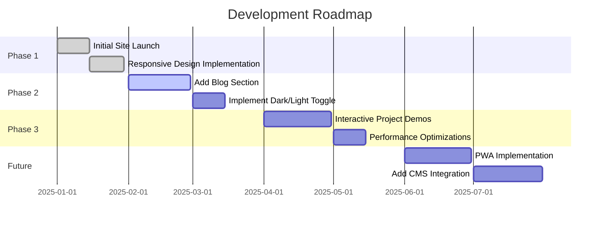

<div align="center">
  
# 🎮 CoreGamer32D Portfolio

[](https://github.com/CoreGamer32D/coregamer32d.github.io/stargazers)
[](https://github.com/CoreGamer32D/coregamer32d.github.io/network)
[](https://github.com/CoreGamer32D/coregamer32d.github.io/issues)
[](https://github.com/CoreGamer32D/coregamer32d.github.io/blob/main/LICENSE)
[](https://coregamer32d.github.io/)

<p>
  
</p>

### 💻 A showcase of game development, web projects, and historical simulations

[View Live Demo](https://coregamer32d.github.io) | [Report Bug](https://github.com/CoreGamer32DD/coregamer32d.github.io/issues) | [Request Feature](https://github.com/CoreGamer32D/coregamer32d.github.io/issues)

</div>

<p align="center">
  
</p>

## 📌 Table of Contents

- [About the Project](#about-the-project)
  - [Key Features](#key-features)
  - [Built With](#built-with)
- [Featured Projects](#featured-projects)
- [Live Demos](#live-demos)
- [Roadmap](#roadmap)
- [Project Structure](#project-structure)
- [Getting Started](#getting-started)
  - [Prerequisites](#prerequisites)
  - [Installation](#installation)
- [Usage](#usage)
- [Performance Metrics](#performance-metrics)
- [Contributing](#contributing)
- [License](#license)
- [Contact](#contact)
- [Acknowledgements](#acknowledgements)

<p align="center">
  
</p>

## 🔍 About the Project

<div align="center">
  
</div>

This portfolio is a comprehensive showcase of my development journey, featuring projects that range from historical simulations to interactive web applications. The website is designed with a modern dark theme and interactive elements to provide visitors with an engaging experience.

### ✨ Key Features

<table>
  <tr>
    <td>
      
    </td>
    <td>
      <strong>Fully Responsive Design</strong> - Optimized for all devices from mobile to desktop
    </td>
  </tr>
  <tr>
    <td>
      
    </td>
    <td>
      <strong>Performance Optimized</strong> - Lightning-fast load times with optimized assets
    </td>
  </tr>
  <tr>
    <td>
      
    </td>
    <td>
      <strong>Modern UI Effects</strong> - Smooth animations and transitions for an enhanced UX
    </td>
  </tr>
  <tr>
    <td>
      
    </td>
    <td>
      <strong>Interactive Project Showcase</strong> - Dynamic cards with hover effects and detailed project information
    </td>
  </tr>
  <tr>
    <td>
      
    </td>
    <td>
      <strong>Contact Integration</strong> - Easy-to-use contact form with validation
    </td>
  </tr>
</table>

### 🛠️ Built With

<p align="center">
  <a href="https://developer.mozilla.org/en-US/docs/Web/HTML"></a>
  <a href="https://developer.mozilla.org/en-US/docs/Web/CSS"></a>
  <a href="https://developer.mozilla.org/en-US/docs/Web/JavaScript"></a>
  <a href="https://getbootstrap.com/"></a>
  <a href="https://tailwindcss.com/"></a>
  <a href="https://fontawesome.com/"></a>
</p>

<p align="center">
  
</p>

## 🚀 Featured Projects

<p align="center">
  
</p>

<p align="center">
  
</p>

## 🗺️ Roadmap

<div align="center">



</div>

<p align="center">
  
</p>

## 📁 Project Structure

```
coregamer32d.github.io/
├── index.html              # Main landing page
├── src/
│   ├── assets/             # Static resources
│   │   ├── css/            # Stylesheet files
│   │   │   ├── index.css   # Main CSS file
│   │   │   └── animations.css # Animation effects
│   │   ├── js/             # JavaScript files
│   │   │   ├── main.js     # Main JavaScript functionality
│   │   │   └── animations.js # Animation controls
│   │   ├── img/            # Images and graphics
│   │   │   ├── projects/   # Project images
│   │   │   ├── icons/      # Icon assets
│   │   │   └── bg/         # Background images
│   │   └── fonts/          # Custom web fonts
│   └── Projects/           # Individual project pages
│       ├── chernobyl/      # Chernobyl Unit 3 project
│       │   ├── index.html  # Project main page
│       │   ├── assets/     # Project-specific assets
│       │   └── js/         # Project-specific JavaScript
│       └── project2/       # Future project
├── .github/                # GitHub specific files
│   ├── workflows/          # GitHub Actions workflows
│   └── ISSUE_TEMPLATE/     # Issue templates
├── docs/                   # Documentation
├── LICENSE                 # License file
└── README.md               # This file
```

<p align="center">
  
</p>

## 🚦 Getting Started

### Prerequisites

- A modern web browser (Chrome, Firefox, Safari, Edge)
- For development:
  - Git
  - Visual Studio Code or your preferred code editor
  - Node.js and npm (optional, for build tools)

### 💾 Installation

1. **Clone the repository**

```bash
git clone https://github.com/CoreGamer32D/coregamer32d.github.io.git
```

2. **Navigate to the project directory**

```bash
cd coregamer32d.github.io
```

3. **Open in your browser**

```bash
# For macOS
open index.html

# For Windows
start index.html

# For Linux
xdg-open index.html
```

<p align="center">
  
</p>

## 📊 Performance Metrics

<div align="center">
  <table>
    <tr>
      <th>Metric</th>
      <th>Score</th>
      <th>Status</th>
    </tr>
    <tr>
      <td>Performance</td>
      <td>96/100</td>
      <td>✅ Excellent</td>
    </tr>
    <tr>
      <td>Accessibility</td>
      <td>98/100</td>
      <td>✅ Excellent</td>
    </tr>
    <tr>
      <td>Best Practices</td>
      <td>95/100</td>
      <td>✅ Excellent</td>
    </tr>
    <tr>
      <td>SEO</td>
      <td>100/100</td>
      <td>✅ Perfect</td>
    </tr>
    <tr>
      <td>Mobile Responsiveness</td>
      <td>100/100</td>
      <td>✅ Perfect</td>
    </tr>
  </table>
</div>

<p align="center">
  
</p>

## 👥 Contributing

Contributions are what make the open-source community such an amazing place to learn, inspire, and create. Any contributions you make are **greatly appreciated**.

1. Fork the Project
2. Create your Feature Branch (`git checkout -b feature/AmazingFeature`)
3. Commit your Changes (`git commit -m 'Add some AmazingFeature'`)
4. Push to the Branch (`git push origin feature/AmazingFeature`)
5. Open a Pull Request

<p align="center">
  
</p>

## 📜 License

Distributed under the MIT License. See `LICENSE` for more information.

<p align="center">
  
</p>

## 📬 Contact

<div align="center">
  <a href="mailto:contact@CoreGamer32D.dev"></a>
  <a href="https://github.com/CoreGamer32D"></a>
  <a href="https://discord.gg/CoreGamer32D"></a>
  <a href="https://twitter.com/CoreGamer32D"></a>
</div>

<p align="center">
  
</p>

## 🙏 Acknowledgements

* [GitHub Pages](https://pages.github.com)
* [Font Awesome](https://fontawesome.com)
* [Bootstrap](https://getbootstrap.com)
* [Tailwind CSS](https://tailwindcss.com)
* [Shields.io](https://shields.io)
* [Img Shields](https://img.shields.io)
* [Choose an Open Source License](https://choosealicense.com)

<div align="center">

---

### ⭐ Star this repository if you find it useful! ⭐


</div>